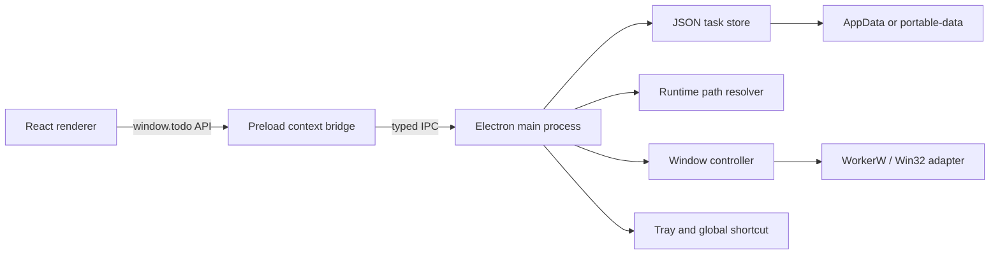
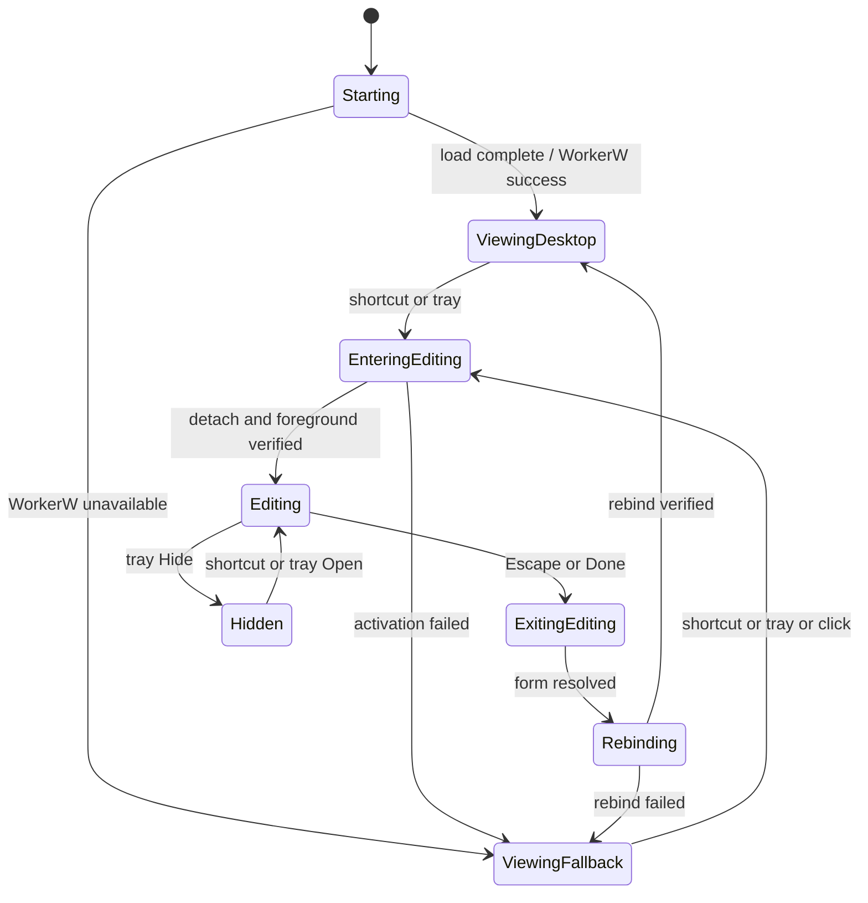

# Windows 桌面 Todo 第一版设计文档

## 1. 文档目标

本文把 `docs/PRD.md` 转换为可实现、可测试的 Electron 第一版技术设计。本文中的“第一版”是 PRD 的首个开发里程碑，以“开发环境可运行”为交付标准，不生成正式安装包或便携包；PRD 中的免安装发布要求保留为后续发布里程碑。本里程碑仍实现并自动测试便携路径解析，避免打包阶段重构数据层。

第一版只实现以下产品范围：

- Windows 10/11 桌面应用。
- Today、Scheduled、All 三个固定视图。
- 查看模式与编辑模式。
- 任务新增、编辑、完成、恢复、删除、撤销删除、排序、日期、一次性系统提醒和搜索。
- 本地 JSON 持久化、普通数据模式和便携数据模式。
- 托盘、全局快捷键、窗口状态记忆。
- WorkerW 桌面层绑定及可观察的降级行为。

第一版不实现账号、云同步、自定义列表、Flagged、附件、复杂重复任务、自然语言日期解析、多次提醒、稍后提醒或置顶模式。

## 2. 设计原则

1. **桌面组件优先**：查看模式属于桌面层，不占任务栏，不覆盖普通应用。
2. **编辑必须可达**：快捷键或托盘触发编辑时，即使普通应用覆盖桌面，也必须能看到并操作 Todo。
3. **数据安全优先**：任何写入失败都不得伪装为成功；旧数据和损坏文件应可诊断、可恢复。
4. **便携路径可重定位**：不在数据中保存依赖盘符的资源绝对路径。
5. **降级不阻断核心功能**：WorkerW、快捷键、字体或开机启动失败时，任务 CRUD 仍可使用。
6. **主进程掌握系统能力**：renderer 不直接访问 Node.js、文件系统或 Win32 API。

## 3. 技术栈与工程结构

### 3.1 技术栈

- Electron：桌面外壳、窗口、托盘、快捷键和 IPC。
- React + TypeScript + Vite：renderer UI。
- Koffi：调用 Win32 API，完成 WorkerW 探测和父窗口切换。
- date-fns：本地日期边界与格式化。
- lucide-react：开源界面图标。
- Vitest：领域、路径、迁移和持久化测试。
- ESLint + TypeScript：静态检查。

任务 ID 使用 `crypto.randomUUID()`，避免为单一能力引入额外 UUID 依赖。

### 3.2 目录结构

```text
todo/
├─ assets/
│  └─ fonts/
├─ docs/
│  ├─ PRD.md
│  └─ DESIGN.md
├─ electron/
│  ├─ main.ts
│  ├─ preload.ts
│  ├─ ipc.ts
│  ├─ desktopLayer.ts
│  ├─ windowController.ts
│  ├─ reminderScheduler.ts
│  ├─ runtimePaths.ts
│  ├─ taskStore.ts
│  ├─ tray.ts
│  └─ types.ts
├─ src/
│  ├─ App.tsx
│  ├─ main.tsx
│  ├─ styles.css
│  ├─ domain/
│  │  ├─ tasks.ts
│  │  └─ tasks.test.ts
│  ├─ components/
│  └─ types.ts
├─ index.html
├─ package.json
├─ tsconfig.json
└─ vite.config.ts
```

## 4. 总体架构



### 4.1 进程职责

| 模块 | 职责 | 禁止事项 |
| --- | --- | --- |
| Renderer | UI、表单状态、固定视图过滤、搜索、乐观交互 | 直接读写磁盘、调用 Win32、接收任意 IPC |
| Preload | 暴露最小、带类型的 `window.todo` API | 暴露完整 `ipcRenderer` 或 Node.js API |
| Main | 任务存储、设置、窗口模式、托盘、快捷键、系统集成 | 承载 UI 领域渲染逻辑 |
| Win32 adapter | 查找 WorkerW、SetParent、SetWindowPos、记录结果 | 在非 Windows 系统加载原生 DLL |

Electron 窗口必须启用 `contextIsolation: true`、`nodeIntegration: false` 和 sandbox。IPC handler 对所有输入进行运行时校验，不能只依赖 TypeScript 类型。

## 5. 核心数据模型

```ts
type ViewId = 'today' | 'scheduled' | 'all';
type DataMode = 'normal' | 'portable';

interface Task {
  id: string;
  title: string;
  notes: string;
  dueDate: string | null;       // 本地日历日，格式 YYYY-MM-DD
  remindAt: string | null;      // ISO 8601 时间戳，一次性系统提醒时间
  notifiedAt: string | null;    // ISO 8601 时间戳，已发出系统通知
  completedAt: string | null;   // ISO 8601 时间戳
  createdAt: string;            // ISO 8601 时间戳
  updatedAt: string;            // ISO 8601 时间戳
  sortOrder: number;
}

interface WindowBounds {
  x: number;
  y: number;
  width: number;
  height: number;
  displayId?: string;
  scaleFactor?: number;
}

interface Settings {
  selectedView: ViewId;
  windowBounds: WindowBounds;
  theme: 'light' | 'dark';
  globalShortcut: string;
  showCompleted: boolean;
  opacity: number;              // 0.72 - 1
  backgroundIntensity: number;  // 0 - 1
}

interface PersistedState {
  schemaVersion: 2;
  tasks: Task[];
  settings: Settings;
}
```

`schemaVersion` 属于持久化根对象，不在运行时设置对象中重复存储。数据模式由独立 bootstrap 输入决定，`requestedDataMode` 与 `effectiveDataMode` 是运行时状态，不写回尚未确定位置的 `state.json`，从根本上避免路径选择循环依赖。

### 5.1 字段约束

- `title`：去除首尾空格后长度 1 到 300；空标题不得保存。
- `notes`：最大 10,000 字符。
- `dueDate`：只存日历日，不存 UTC 午夜，避免时区转换导致日期前移或后移。
- `remindAt`：存 ISO 8601 绝对时间戳，由 renderer 的本地 `datetime-local` 输入转换而来；为空表示不提醒。
- `notifiedAt`：系统通知成功发出后由主进程写入；修改 `remindAt` 时清空，完成或删除任务时不再提醒。
- `sortOrder`：有限数字；保存前按当前顺序归一化为 0、1000、2000……。
- 时间戳：由主进程生成或校正，renderer 不决定可信更新时间。
- 未知字段：迁移时忽略；关键字段无效的任务放入恢复报告而不是静默丢弃。

## 6. 固定视图语义

日期判断以 Windows 当前本地时区和本地日历日为准，每次午夜、系统唤醒、时区变化或窗口重新激活时重算。

| 视图 | 默认（隐藏已完成） | 显示已完成开启后 |
| --- | --- | --- |
| Today | `dueDate <= 今天`，包括逾期任务 | 移除完成状态过滤，显示所有 `dueDate <= 今天` 的任务 |
| Scheduled | `dueDate > 今天` | 移除完成状态过滤，显示所有 `dueDate > 今天` 的任务 |
| All | 全部未完成任务 | 全部任务 |

无截止日期任务只出现在 All。搜索始终在当前视图结果内匹配标题和备注，忽略大小写并去除查询首尾空格。空查询恢复当前视图。

同一任务只存一份，由过滤规则进入多个视图；Today 是 Scheduled 的互斥日期区间，但二者都属于 All。三个侧栏计数始终只统计未完成任务，不随“显示已完成”开关变化。

## 6.1 系统提醒语义

- 每个任务最多一个 `remindAt`。提醒时间与 `dueDate` 独立，截止日期只影响 Today / Scheduled / All 归类。
- 主进程加载数据后，为所有 `remindAt` 在未来、未完成、未通知的任务注册一次性 `setTimeout`；任务新增、修改、完成、删除、恢复后清空旧计时器并按最新状态重建。
- 不做每分钟轮询。超过 Node.js 单个计时器上限的远期提醒分段等待，到达最终时间后再发通知。
- 如果应用启动、系统唤醒或数据刷新时发现 `remindAt <= now` 且任务仍未完成、未通知，应立即补发一次系统通知。
- 系统通知由 Electron main process 创建；renderer 不直接调用通知 API。
- 用户点击通知时进入编辑模式，方便处理对应任务；第一版不承诺自动滚动或聚焦到具体任务行。
- Windows 通知能力不可用时不阻断任务 CRUD；后续可以在状态面板补充通知能力状态。

## 7. 窗口与模式状态机



### 7.1 查看模式

- 尝试把 BrowserWindow HWND 绑定为 WorkerW 子窗口。
- 不显示任务栏项，不抢焦点，窗口为可见但低打扰状态。
- 查看模式只读：任务完成按钮仅作状态图形，不响应任务变更；拖动、搜索和编辑控件隐藏，不提供窗口内编辑按钮。
- 普通应用窗口应覆盖它，符合“桌面最底层”。

### 7.2 编辑模式

WorkerW 子窗口无法可靠浮到普通应用上方，因此进入编辑模式时必须：

1. 记录当前位置和尺寸。
2. 保存 WorkerW 客户区坐标对应的屏幕 DIP bounds，调用 `SetParent(hwnd, NULL)` 脱离 WorkerW。
3. 恢复顶层窗口 style/exStyle，触发 `SWP_FRAMECHANGED`，保持 `alwaysOnTop: false`。
4. 由明确的快捷键或托盘用户动作触发 `show()`、`restore()`、`focus()` 和一次性前台激活；验证可见与焦点结果，失败时在托盘通知和状态面板反馈，但不建立持续置顶。
5. 展示搜索、添加、编辑、删除、日期、提醒时间和设置控件。

退出编辑时先提交或取消当前表单，再尝试重新绑定 WorkerW。绑定失败则进入 `ViewingFallback`，窗口置底但不伪装成成功。所有模式转换进入单一串行队列，并分配递增 generation；Explorer 重建、快捷键连按或过期重绑回调只能提交当前 generation 的结果。

### 7.3 未保存编辑

- 行内标题失焦时保存；空标题取消该次新增或保留原标题。
- Escape 的优先级：先关闭弹层；再取消当前未提交编辑；最后退出编辑模式。
- 应用退出时若存在合法的已修改表单，先尝试保存；失败则阻止静默退出并显示错误。
- 窗口不能因当前表单状态而直接销毁；关闭按钮语义为回到查看模式，退出应用只通过托盘“退出”。

## 8. WorkerW 绑定设计

### 8.1 Windows API

通过 `BrowserWindow.getNativeWindowHandle()` 读取 HWND，并使用 Koffi 调用：

- `FindWindowW`
- `SendMessageTimeoutW`
- `EnumWindows`
- `FindWindowExW`
- `SetParent`
- `SetWindowPos`
- `GetParent`
- `IsWindow`
- `GetWindowLongPtrW`
- `SetWindowLongPtrW`
- `ScreenToClient`
- `ClientToScreen`
- `ReplaceFileW`

### 8.2 绑定算法

1. 查找 `Progman`。
2. 向 Progman 发送 `0x052C`，请求创建 WorkerW。
3. 枚举顶层窗口，寻找包含 `SHELLDLL_DefView` 的窗口。
4. 只接受位于承载 `SHELLDLL_DefView` 窗口之后、且经层级探测验证的 WorkerW；不把图标承载窗口本身作为备用父窗口。
5. 记录当前 style/exStyle 和屏幕 DIP bounds，换算为目标 WorkerW 客户区物理坐标。
6. 调整 `WS_CHILD` / `WS_POPUP` 等必要 style，调用 `SetParent(todoHwnd, workerWHwnd)` 和带 `SWP_FRAMECHANGED` 的 `SetWindowPos`。
7. 验证 Todo HWND、WorkerW HWND、父子关系、可见性、位置和目标 Z 序，再写入结构化状态。
8. 目标 Z 序固定为“壁纸 < Todo < 桌面图标 < 普通应用窗口”；无法证明该层级时直接 fallback。

不得只以 `SetParent` 非零返回值判断成功；原父窗口可能为空。必须在调用后用 `GetParent` 验证。

### 8.3 Explorer 生命周期

Explorer 重启、显示配置变化或桌面重建会使 WorkerW 句柄失效。每次校验同时检查 Todo HWND、WorkerW HWND 和当前父子关系。以下事件触发重新探测：

- 从编辑模式回到查看模式。
- Windows `TaskbarCreated` 广播（可实现时）。
- 显示器配置变化、系统解锁或应用恢复。
- 定时轻量校验发现 `IsWindow(workerW) === false`。

重绑前取消旧句柄引用；重绑失败不循环高频重试，使用指数退避并保留托盘手动“重试桌面绑定”。显示器变化时根据已保存 displayId、DIP bounds 和相对工作区位置选择最大相交或最近显示器，约束到可见工作区后按当前 scaleFactor 重新换算坐标。

### 8.4 降级行为

- 创建透明无边框顶层窗口，`skipTaskbar: true`、`alwaysOnTop: false`。
- 启动和退出编辑时调用置底操作，但 Windows 不保证它永久处于桌面图标层。
- UI 状态面板显示“桌面绑定已降级”，日志记录原因。
- 降级不阻止任务查看、编辑、托盘或快捷键。

## 9. 运行路径与便携模式

### 9.1 路径解析

`resolveRuntimePaths()` 在 `app.whenReady()` 之前完成影响 `userData` 的部分，在 ready 后完成目录可写检查。开发环境的程序根目录是仓库根目录；打包后是可执行文件所在目录。

```ts
interface RuntimePaths {
  appRoot: string;
  assetRoot: string;
  requestedMode: DataMode;
  effectiveMode: DataMode;
  dataDir: string;
  stateFile: string;
  logDir: string;
  fallbackReason?: 'portable-not-writable';
}
```

模式优先级：

1. 命令行 `--portable`。
2. 程序根目录存在 `portable.flag`。
3. 程序根目录独立的 `bootstrap.json` 中的显式选择。
4. 默认普通模式。

便携模式目录为 `<appRoot>/portable-data/`；普通模式为 Electron `app.getPath('userData')`。字体始终从 `<assetRoot>/fonts/` 解析，不依赖数据盘符。

### 9.2 可写性检测

不能仅检查目录属性。应在目标目录创建随机临时文件、写入、刷新并删除。任何一步失败均视为不可写。

- 便携目录不可写：降级到普通模式，保留 `requestedMode: portable` 和原因。
- 普通目录不可写：应用进入只读保护状态，允许查看内存中已加载数据，但禁用变更并显示明确错误。
- 运行中移动盘拔出：当前内存数据保留；后续写入失败并进入“有未持久化更改”状态。应用尝试把带源路径指纹和 revision 的紧急恢复副本写到系统用户数据目录；它不改变 effective mode，也不会与便携主文件自动合并。普通退出会要求重试、确认已生成恢复副本或明确放弃，不能静默丢失。
- 盘符变化：所有路径每次启动相对 `appRoot` 重算，因此无需迁移数据内路径。

### 9.3 数据模式切换

第一版保留底层接口和状态展示，不提供自动无提示切换。用户显式切换时流程为：暂停写入、刷新当前状态、复制到目标临时目录、校验 JSON、原子重命名、更新 `bootstrap.json`、切换有效路径。任一步失败都继续使用源路径。运行中盘符变化要求用户重新启动，启动后基于新的 `appRoot` 自动定位；第一版不做热重定位。

## 10. 持久化、迁移与恢复

### 10.1 文件布局

```text
dataDir/
├─ state.json
├─ state.json.bak
├─ state.json.tmp-<pid>-<nonce>
├─ state.lock
└─ logs/
   └─ app.log
```

### 10.2 读取流程

1. `state.json` 不存在：创建内存默认状态，首次变更时落盘。
2. 存在：读取、解析、校验、按版本逐级迁移。
3. 主文件损坏：尝试读取 `.bak`。
4. 备份可用：从备份启动，保留损坏主文件副本并提示用户。
5. 两者都损坏或迁移失败：不覆盖原文件；以只读恢复模式启动空状态并给出实际文件位置。
6. 文件 schema 高于当前版本：禁止写回，避免旧版本破坏新数据。
7. 遗留临时文件只有在主文件不可用、schema 可读、内容校验通过且 revision 更新时才作为人工确认的恢复候选，绝不自动覆盖主文件。
8. 同一 schema 内读取时无损保留未知字段；任何会删除或改变字段语义的结构变化必须提升 schemaVersion。

### 10.3 写入流程

同一时刻只允许一个保存操作。变更进入串行保存队列：

1. 序列化并校验完整状态。
2. 写入唯一临时文件。
3. 刷新临时文件内容到磁盘。
4. 校验当前主文件 hash/revision 未被外部改变。
5. 使用 `ReplaceFileW` 原子替换主文件并同时生成 `.bak`；主文件不存在时使用同卷原子重命名。
6. 成功后通知 renderer 新 revision。

Windows 上目标文件被占用时，有限次数指数退避重试。最终失败时保留内存 revision 和错误，不返回成功；下一次变更基于最新内存状态继续排队，避免旧保存覆盖新保存。

### 10.4 并发实例

使用 `app.requestSingleInstanceLock()` 防止同一应用会话重复启动；在最终数据目录解析后，再以规范化 `stateFile` 路径为键创建 `state.lock` 文件级互斥。锁包含 PID、启动时间和路径 hash，只有确认进程已不存在才清理陈旧锁。第二实例不直接读写数据，而是通知第一实例进入编辑模式；无法取得数据锁时以只读状态启动或退出，绝不并发写入。

## 11. IPC 契约

Preload 只暴露：

```ts
window.todo = {
  getSnapshot(): Promise<AppSnapshot>;
  createTask(input: CreateTaskInput): Promise<MutationResult>;
  updateTask(input: UpdateTaskInput): Promise<MutationResult>;
  setTaskCompleted(id: string, completed: boolean): Promise<MutationResult>;
  deleteTask(id: string): Promise<MutationResult>;
  restoreDeletedTask(token: string): Promise<MutationResult>;
  reorderTasks(ids: string[]): Promise<MutationResult>;
  updateSettings(input: PartialSettingsInput): Promise<MutationResult>;
  setEditMode(editing: boolean): Promise<WindowModeResult>;
  retryDesktopBinding(): Promise<DesktopBindingStatus>;
  onSnapshotChanged(callback): Unsubscribe;
  onEditModeChanged(callback): Unsubscribe;
};
```

每个 mutation 带 `baseRevision`。主进程若发现 revision 过期，返回最新 snapshot，由 renderer 合并表单或提示重新操作，避免托盘/快捷键事件与 UI 保存交叉时丢更新。mutation 只有在原子替换成功后才返回成功；UI 只对已确认 revision 展示持久化成功。

任务 mutation 成功后，main process 重新计算提醒计时器；提醒发出并写入 `notifiedAt` 后同样广播新 snapshot，保证 UI 和持久化状态一致。

删除撤销 token 只在当前进程内有效，默认 8 秒；真正删除立即持久化，撤销时按原数据重新插入并重新保存。应用退出后不承诺撤销。

## 12. UI 与交互设计

### 12.1 视觉方向

采用“安静的桌面纸张”方向：接近 Reminders 的浅色、清晰、克制和高可读性，但不复制 Apple 专有图标或完整布局。

- 左侧为磨砂浅灰导航区，右侧为暖白任务纸面。
- 强调色：Today 蓝、Scheduled 珊瑚红、All 石墨灰。
- 圆角不超过 8px，主窗口圆角由透明窗口外壳表达。
- 任务区保持紧凑，避免营销页式大卡片。
- SF Pro Display 用于视图标题，SF Pro Text 用于任务和控件；fallback 为 `Segoe UI Variable`, `Segoe UI`, sans-serif。
- 动画只用于模式切换、任务完成和撤销提示，并尊重 `prefers-reduced-motion`。

### 12.2 布局

- 默认窗口 900 × 620，最小 680 × 460。
- 侧栏宽度 238px；小于 760px 时收窄为 196px，不隐藏固定入口。
- 顶部保留窗口拖动区，交互控件设置 `-webkit-app-region: no-drag`。
- 侧栏固定三个入口，不显示 My Lists、Add List 或 Flagged。
- 查看模式隐藏搜索框、编辑工具和窗口内编辑入口，只保留列表与任务内容。
- 编辑模式显示搜索、添加按钮、任务详情控件和明确“完成编辑”按钮。

### 12.3 任务交互

- 圆形完成按钮只在编辑模式可操作；点击后等待主进程确认，失败时回滚并显示错误。
- 新任务默认无日期，在 All 中创建；在 Today 创建时默认今天，在 Scheduled 创建时默认明天。
- Scheduled 新任务的默认明天日期只作为预填值，用户可以修改。
- 新任务默认无提醒时间；用户可以在编辑底栏选择具体日期时间。清空提醒时间会取消尚未触发的系统通知。
- 删除显示 8 秒撤销条，同一时间仅保留最近一次删除 token；新的删除会使上一次撤销窗口结束。
- 拖拽只在当前视图内改变可见任务顺序；主进程据完整任务序列稳定合并，隐藏任务相对顺序不变。
- 已完成任务区与未完成任务分组，避免完成项与活动项混排。

### 12.4 空状态与错误状态

- 空视图：“No Reminders”，附当前视图的简短中文说明。
- 搜索无结果：“没有匹配的任务”。
- 只读保护：顶部固定状态条，禁用所有变更控件但允许复制任务文本。
- 数据恢复：显示来自备份或只读恢复状态及数据文件位置。
- 快捷键冲突、WorkerW 降级和便携目录降级集中显示在设置状态面板，不用阻断弹窗反复打扰。

## 13. 快捷键、托盘与启动

- 默认快捷键：`Ctrl+Alt+T`。
- 首次注册失败时状态为“未激活”，托盘仍是可靠入口。修改快捷键采用“先注册新值，成功后释放旧值并提交设置”；失败则保留旧快捷键和设置值。
- 快捷键触发：查看/隐藏状态进入编辑；编辑状态退出前必须执行未保存表单保护，再回到桌面层。
- 托盘菜单：打开编辑、回到桌面、重试桌面绑定、退出。
- 单击托盘图标切换编辑模式；菜单提供确定性操作。
- 托盘资源缺失时应用仍运行，并记录降级；开发版可使用程序生成的简洁模板图标。
- 开机启动第一版只保留状态接口；开发运行路径变化大，不默认启用。

## 14. 日志与隐私

- 日志记录时间、级别、模块、错误码和路径类别。
- 默认不记录任务标题、备注或完整用户目录路径。
- 路径显示给用户时可显示完整实际位置，但日志中只记录 `normal` / `portable` 和错误代码。
- 日志滚动上限 2 MB，保留当前和一个历史文件。

## 15. 边缘场景决策

| 场景 | 预期行为 |
| --- | --- |
| 系统日期跨午夜 | 重新计算三个视图和计数 |
| 系统时区变化 | 按新的本地日历日重算，存储日期字符串不变 |
| 夏令时切换 | `dueDate` 不受 UTC 偏移影响 |
| Explorer 重启 | WorkerW 状态失效，退避重绑；任务数据不受影响 |
| 多显示器拔插 | 将窗口约束到最近可用显示器工作区，再尝试重绑 |
| 保存时 U 盘拔出 | 标记未持久化，保留内存数据并允许重试 |
| JSON 被手工编辑损坏 | 尝试备份；禁止静默覆盖损坏文件 |
| 新版本数据被旧版本打开 | 只读启动，不降低 schema |
| 快捷键被占用 | 保留应用可用性并显示冲突状态 |
| 提醒时间到达时任务已完成或已删除 | 不弹通知，不写入新的提醒状态 |
| 提醒时间修改 | 取消旧计时器，清空 `notifiedAt`，按新时间重新注册 |
| 应用关闭期间错过提醒 | 下次启动发现未通知且已到期时补发一次 |
| 电脑睡眠跨过提醒时间 | 恢复后计时器触发或数据刷新时补发一次 |
| 系统通知不可用 | 不阻断任务 CRUD，提醒能力降级可在状态面板暴露 |
| SF Pro 拉丁字体单个文件缺失或损坏 | 对该字重使用 `Segoe UI Variable`, `Segoe UI`, sans-serif；文本不得溢出、遮挡或出现异常断行 |
| 中文字体缺失或损坏 | 依次使用系统 `PingFang SC`、`Microsoft YaHei UI` 和 sans-serif；不得显示缺字方框或改变布局尺寸 |
| 标题全为空格 | 不创建；编辑时恢复原值 |
| 快速连续点击完成 | 主进程序列化 mutation，最终状态以 revision 为准 |
| 第二实例启动 | 激活第一实例编辑模式，第二实例退出 |
| 关机/会话结束 | 已向 UI 确认成功的数据已落盘；尚未确认的操作尽力刷新但可能被系统强制终止 |

## 16. 测试策略

### 16.1 自动化测试

- 视图：Today 包括今天和逾期；Scheduled 只含未来；All 含所有活动任务。
- 已完成：默认隐藏；开启后按各视图规则出现。
- 搜索：标题、备注、大小写、空白查询和当前视图边界。
- 排序：相同排序值稳定、归一化、隐藏任务合并。
- 日期：午夜、时区变化和本地日期解析。
- 提醒：保存 `remindAt`、写入 `notifiedAt`、修改提醒后重置通知状态、完成/删除后不再提醒。
- schema：默认状态、v1 到 v2 迁移、未来版本只读、损坏主文件读取备份。
- 保存：串行 revision、临时文件清理、替换失败、文件占用重试。
- 故障注入：保存各步骤中断、WorkerW 切换中 Explorer 重启、移动盘拔出和 DPI 变化。
- 路径：普通、`--portable`、`portable.flag`、空格/中文路径、不可写便携目录、盘符变化。
- 窗口：WorkerW 探测成功、SetParent 后验证失败、Explorer 句柄失效和 fallback。
- 快捷键：注册成功、冲突、替换失败时保留旧值。
- 设置：主题默认值、白色/黑色选择持久化和旧数据缺少主题字段时的迁移默认值。

### 16.2 手工 QA

- Windows 10/11，100%、125%、150% 缩放。
- 单显示器和双显示器，拔插副屏后窗口仍可见。
- 普通目录、中文/空格目录、模拟移动盘目录。
- 查看模式被普通应用覆盖，快捷键后编辑窗口可见并聚焦。
- 托盘进入编辑和返回桌面均可用。
- 重启后任务、设置、视图、窗口位置保留。
- WorkerW 失败时状态可见且 CRUD 正常。
- 四种 SF Pro 拉丁字体和中文字体分别缺失/损坏、白色/黑色主题切换、自定义快捷键首次冲突、只读数据目录时行为符合降级定义。

## 17. 第一版验收标准

1. `npm run dev` 在 Windows 上启动 Electron 应用，renderer 无 Node.js 直连能力。
2. Today、Scheduled、All 的过滤、计数和搜索符合第 6 节定义。
3. 编辑模式可完成任务 CRUD、日期、完成/恢复、排序和撤销删除。
4. 编辑模式可设置和清除提醒时间；到期后通过 Windows 系统通知提示，且不依赖每分钟轮询。
5. 任务保存到 JSON，应用重启后恢复；写入失败明确反馈。
6. 默认尝试 WorkerW；成功时查看窗口位于普通应用之后，失败时进入可观察 fallback。
7. 快捷键或托盘可把被覆盖的查看窗口切换为可聚焦编辑窗口；退出编辑后恢复桌面层。
8. 普通和便携路径解析可测试；便携不可写时降级到普通目录并显示状态。
9. 四个 SF Pro 拉丁字符 WOFF2 和一个简体中文 WOFF2 子集从 `assets/fonts` 加载；系统有苹方时中文优先使用苹方，任一字体缺失或损坏时使用中文友好的系统 fallback，文本不溢出或遮挡。
10. 白色、黑色主题均可在设置中切换并持久化；常规尺寸与最小尺寸下无文本重叠、控制溢出或不可辨识状态。
11. UI 不出现自定义列表、Flagged、账号、云同步或置顶设置。
12. `npm test`、`npm run typecheck` 和 `npm run build` 通过。

## 18. 实施顺序

1. 建立 Electron/Vite/React 工程和共享类型。
2. 实现任务领域过滤、搜索、排序及测试。
3. 实现路径解析、JSON store、迁移和故障测试。
4. 实现 BrowserWindow、preload、IPC、托盘和快捷键。
5. 实现 WorkerW adapter、编辑态脱离/查看态重绑和 fallback。
6. 实现 UI、字体、任务操作、状态面板和响应式布局。
7. 完成自动化检查、开发启动和 Windows 手工验证。

## 19. 需求追踪与审查结论

| PRD 能力 | 设计章节 | 第一版验收 |
| --- | --- | --- |
| 桌面最底层 | 7、8 | 5、6 |
| 查看/编辑模式 | 7、12 | 3、6 |
| 三个固定视图 | 6、12 | 2、9 |
| 本地可靠存储 | 9、10、11 | 4、7 |
| 便携路径 | 9 | 7；正式便携包属于后续发布里程碑 |
| 快捷键与托盘 | 7、13 | 6 |
| SF Pro 与 fallback | 12、15 | 8 |
| 一次性系统提醒 | 5、6.1、11、12 | 4 |

子智能体审查后采纳了 WorkerW 精确层级、模式转换串行化、独立 bootstrap、移动盘紧急恢复、原子替换、文件级锁、schema 只读保护、首次快捷键冲突和字体部分缺失等修订。未采纳把本开发里程碑扩展为正式便携包，也明确不增加每显示器独立窗口、外部 JSON 自动合并、长期版本历史、账号、云同步、自定义列表、Flagged 或置顶模式。
